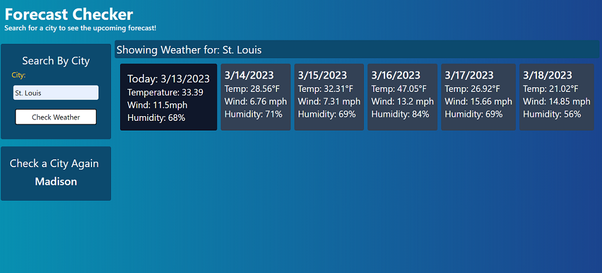

# Weather-checker

This is a simple weather checker that uses the OpenWeatherMap API to get the weather for a given city. It is deployed on Github and does not require any installation.

## Table of Contents

- [OpenWeatherMap API](#openweathermap-api)
- [Usage](#usage)
- [Mockup](#mockup)
- [Author](#author)

## OpenWeatherMap API

OpenWatherMap is a free weather API that cna provide weather data for any city in the world. It is free to use and does not require any registration. You can find the API documentation [here](https://openweathermap.org/api). With it, you can get the current weather, the weather for the next 5 days, and the weather for the next 16 days. This includes the temperature, the humidity, the wind speed, and the weather description, etc.

## Usage

To use this app, simply go to the [Github page](https://eabaynes.github.io/Weather-checker/) and enter the name of the city you wish to check the weather for. The current weather will display, as well as a 5-day noon forecast. If you want to save a city to search it again later, click the "Save City" button that appears when you search for the city. This will save the city to your browser's local storage. When you return to the page, you will see your previous searches under the "Check a City Again" section. Clicking one of these buttons will autofill with search bar with the name of that city. Simply press the "Check Weather" button to see the weather for that city again.

## Mockup

## Author

Elliot is an aspiring developer learning a multitude of skills, including Javascript, React, Node.js, and more. He is currently working on a D&D random encounter and loot generator, as well as a VR game! Check out his Github [here](https://github.com/eabaynes).